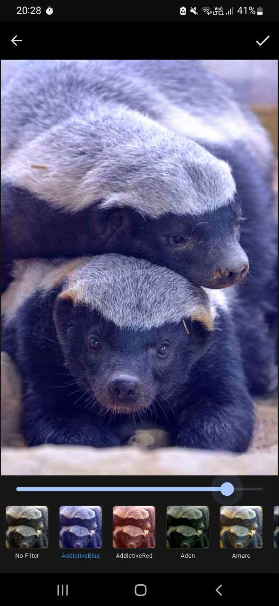
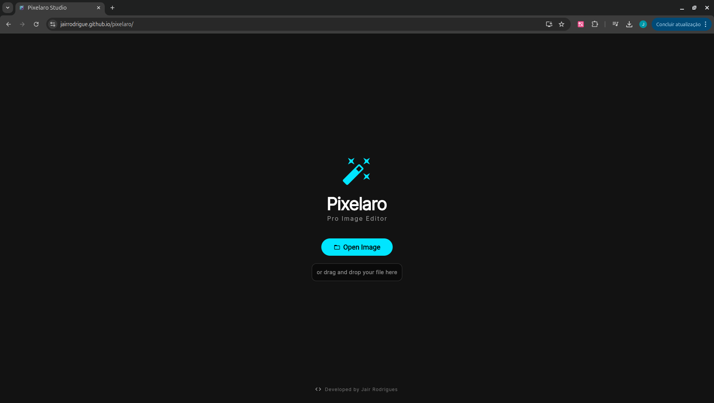
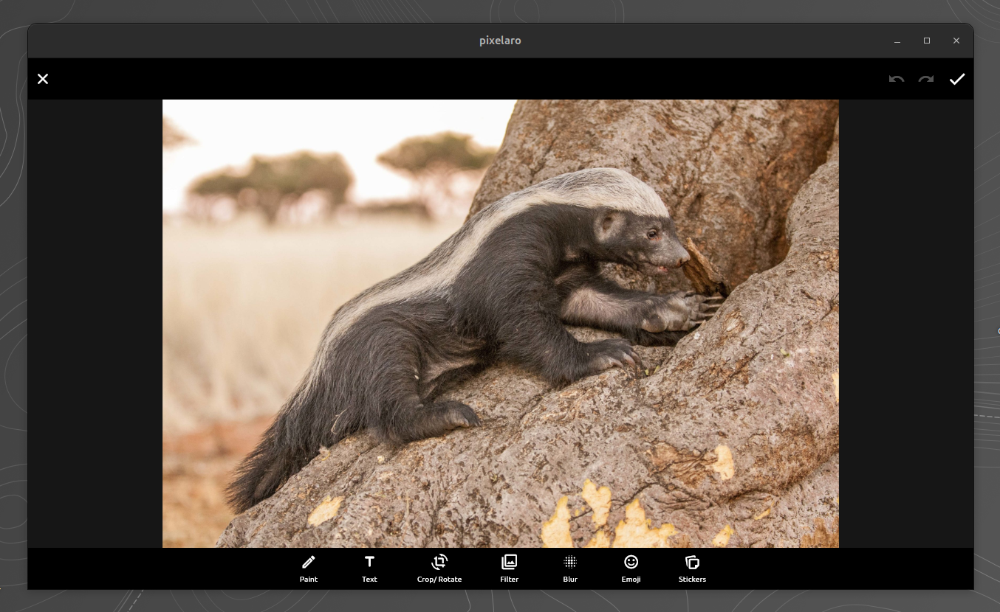

<div align="center">

  
  
  # Pixelaro
  
  **Pro Image Editor | Cross-Platform**

  <p>
    <a href="https://flutter.dev">
      
    </a>
    <a href="LICENSE">
      
    </a>
    <a href="https://snapcraft.io/pixelaro">
      
    </a>
  </p>

  <p>
    <a href="#-features">Features</a> •
    <a href="#-downloads--access">Downloads</a> •
    <a href="#-screenshots">Screenshots</a> •
    <a href="#-how-to-contribute">Contributing</a>
  </p>
</div>

---

## 🚀 About

**Pixelaro** is a modern, high-performance image editor built with **Flutter**. It is designed to be lightweight, fast, and accessible on any device. Whether you are on your phone, desktop, or just using a web browser, Pixelaro provides essential editing tools with a smooth user experience.

## 📥 Downloads & Access

| Platform | Type | Status | Link |
| :--- | :--- | :--- | :--- |
| **🌍 Web** | Browser | **Live** | [**Try Pixelaro Online**](https://jairrodrigue.github.io/pixelaro/) |
| **🐧 Linux** | Snap Store | **Stable** | [`sudo snap install pixelaro`](https://snapcraft.io/pixelaro) |
| **🤖 Android**| APK | **v1.0.0** | [**Download APK**](https://github.com/JairRodrigue/pixelaro/releases/latest) |
| **📦 All** | Binaries | **Releases** | [View all Releases](https://github.com/JairRodrigue/pixelaro/releases) |

---

## 📸 Screenshots
<table>
  <tr>
    <td width="30%">
      
    </td>
    <td>
       
       <br><br>
       
    </td>
  </tr>
</table>
---

## ✨ Features

* **✂️ Crop & Rotate:** Easily adjust the aspect ratio and orientation of your images.
* **🎨 Filters:** Apply professional presets (Aden, Amaro, Lark, and more).
* **🖌️ Drawing Tools:** Paint freely with customizable brushes and colors.
* **📝 Text & Stickers:** Add text overlays and emojis to your creations.
* **⚡ High Performance:** Powered by Flutter's Impeller/Skia engine.
* **🔒 Privacy Focused:** All processing happens locally on your device (Web version uses WebAssembly).

---

## 🛠️ Local Development

If you want to run this project locally or contribute code:

### Prerequisites
* [Flutter SDK](https://flutter.dev/docs/get-started/install)
* Git

### Installation

1.  **Clone the repository**
    ```bash
    git clone https://github.com/JairRodrigue/pixelaro.git
    cd pixelaro
    ```

2.  **Install dependencies**
    ```bash
    flutter pub get
    ```

3.  **Run the app**
    ```bash
    # For Web
    flutter run -d chrome

    # For Desktop (Linux/Windows/Mac)
    flutter run -d linux
    ```

---

## 🤝 How to Contribute

Contributions are what make the open-source community such an amazing place to learn, inspire, and create. Any contributions you make are **greatly appreciated**.

1.  **Fork** the project.
2.  Create your Feature Branch (`git checkout -b feature/AmazingFeature`).
3.  **Commit** your changes (`git commit -m 'Add some AmazingFeature'`).
4.  **Push** to the Branch (`git push origin feature/AmazingFeature`).
5.  Open a **Pull Request**.

---

## 📄 License

Distributed under the **BSD-2-Clause License**. See `LICENSE` for more information.

---